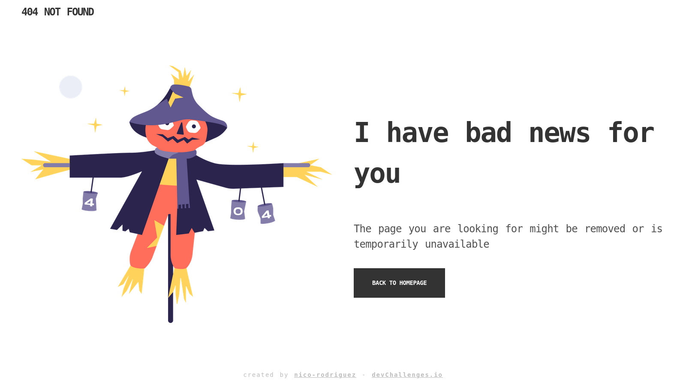
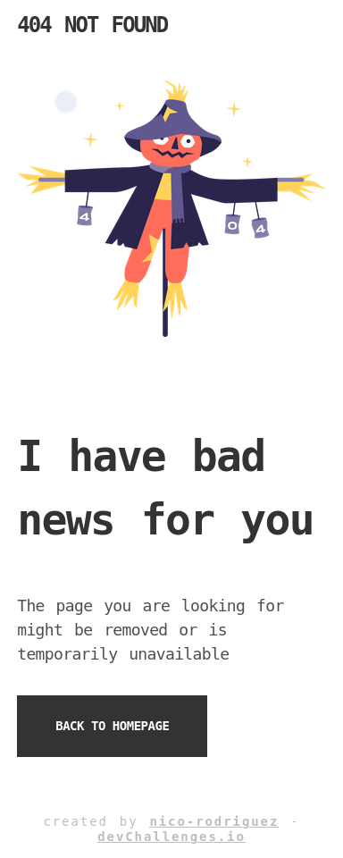

<h1 align="center">404 Not Found</h1>

   Solution for a challenge from  <a href="http://devchallenges.io" target="_blank">Devchallenges.io</a>.

  <h3>
    <a href="https://404-not-found-903ea1.netlify.app/">
      Solution
    </a>
     | 
    <a href="https://devchallenges.io/challenges/wBunSb7FPrIepJZAg0sY">
      Challenge
    </a>
  </h3>

## Overview

Visit [https://404-not-found-903ea1.netlify.app/](https://404-not-found-903ea1.netlify.app/).

Desktop

Mobile

## Features

This application/site was created as a submission to a [DevChallenges](https://devchallenges.io/challenges) challenge. The [challenge](https://devchallenges.io/challenges/wBunSb7FPrIepJZAg0sY) was to build an application to complete the given user stories.

The main content is displayed as `grid`, with `auto-fit` and `minmax`, which creates a responsive grid that wraps its contents on small screen devices.
